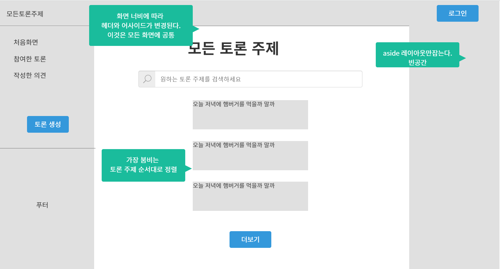
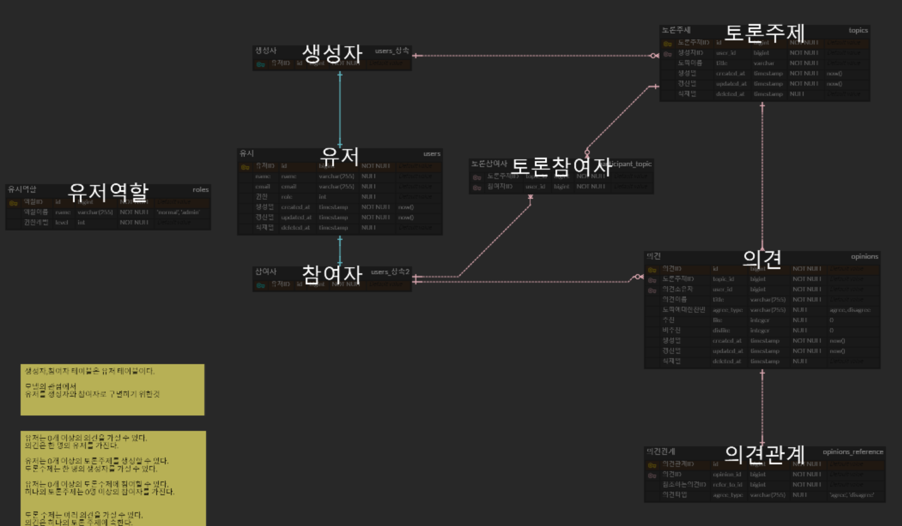
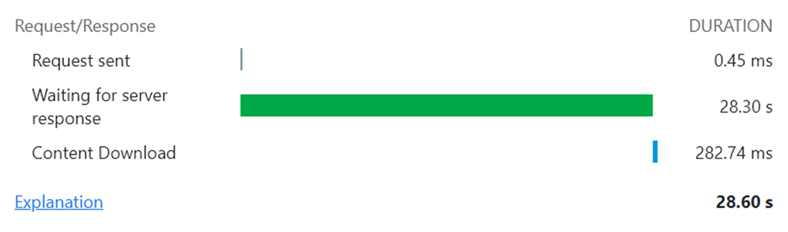
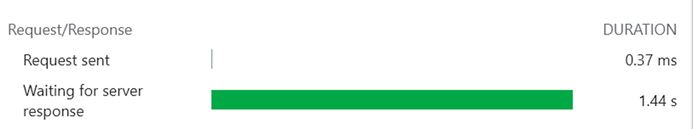

# 목차

- [개요](#개요)
- [기술 스택](#기술-스택)
- [목업](#목업)
- [ERD](#erd)
- [배포](#배포)
- [구현](#구현)
    - [구현 내용](#구현-내용)
        - [토론 주제, 의견, 의견간 관계에 대한 REST API](#토론-주제-의견-의견간-관계에-대한-rest-api)
        - [ChatGpt API 의견 요약](#chatgpt-api-의견-요약)
        - [seed, factory 기반 데이터베이스 관리](#seed-factory-기반-데이터베이스-관리)
        - [이메일 인증](#이메일-인증)
        - [도커 기반 개발환경 구축](#도커-기반-개발환경-구축)
    - [구현 중 해결한 문제](#구현-중-해결한-문제)
        - [문제 1. 개발 환경 구축](#문제-1-개발-환경-구축)
        - [문제 2. 아마존 라이트 세일에 배포](#문제-2-아마존-라이트-세일에-배포)
        - [문제 3. xdebug를 통한 라인 브레이크 디버깅(PHPStorm)](#문제-3-xdebug를-통한-라인-브레이크-디버깅phpstorm)

# 개요

토론 웹 서비스 모두의 토론의 백엔드 레포지토리이다. [실행링크](https://www.every-discussion.com/)

[프론트엔드 바로가기](https://github.com/HaejinYang/every-discussion-frontend)

# 기술 스택

- Laravel, MySQL, Redis
- AWS Lightsail, Docker

# 목업

프로젝트 진행 전 구상을 위한 목업이다. 카카오 오븐으로 개발할 페이지를 구상했다. 자세한 내용은
다음 [링크](https://ovenapp.io/view/vHYglcf3PXrqDKcqUOXYsBKKf7CJflvs/OvHxh)에서 확인 가능하다.


# ERD

프로젝트 설계를 위한 ERD이다. ERDCloud로 제작했다. 자세한 내용은 다음 [링크](https://www.erdcloud.com/d/BiBhWnCtC8YRWNjMJ)에서 확인할 수 있다.


# 배포

[실행링크](https://www.every-discussion.com/)

모두의 토론 백엔드는 도커 위에 개발 환경을 구축했다. php-apache 이미지를 기반으로 라라벨 웹 서버를 구동시키고, redis 이미지를 활용하여 job을 처리하고, mysql 이미지를 활용하여 데이터베이스를
사용했다. 세 컨테이너를 관리하기 위하여 도커 컴포즈를 활용했다. 따라서 배포 역시 도커를 기반으로 하면 좋을 것이라고 생각하고 진행했다.

[배포 과정을 정리한 링크](https://crmerry.tistory.com/228)

# 구현

## 구현 내용

### 토론 주제, 의견, 의견간 관계에 대한 REST API

토론 주제, 의견, 의견간 관계를 위해 REST API를 구현했다.
자원(토론 주제, 의견, 의견간 관계)을 정의하고, 이 자원을 유일하게 식별할 수 있도록 `/api/opinions/:id`와 같은 URI를 정의했다.
자원을 조작하기 위하여 HTTP의 메소드 `GET(조회), POST(생성 및 수정), PUT(덮어쓰기), DELETE(삭제)`를 활용하였다. 자원을 표현하기 위하여 JSON 형식을 사용하였다.

라라벨은 라우트의 URI에 모델을 바운딩하고 요청을 처리하는 핸들러에 모델을 명시하면 ID를 기반으로 라라벨의 서비스 컨테이너가 모델을 주입해주는 기능이 있어 이를 활용하였다.

모델이 없을 경우를 대비하여 Exception에 ModelNotFoundException인 경우 HTTP_NOT_FOUND 코드를 리턴하도록 정의해주었다.
API를 구현하면서, json 응답을 위한 trait을 생성하여 json 응답이 필요한 곳들에서 재사용하였다.

### ChatGpt API 의견 요약

의견 등록, 수정 요청이 오면, ChatGpt API릉 이용하여 의견을 요약한다.
컨트롤러에서 바로 동기적으로 처리하면 응답이 너무 늦어지므로, job을 생성하여 queue에서 처리할 수 있도록 구현했다.
queue은 라라벨의 horizon을 사용하였다.

### seed, factory 기반 데이터베이스 관리

데이터베이스 셋업을 위해서 라라벨이 제공하는 migration, seed, factory를 사용하였다.
migration을 이용하여 테이블을 관리하고 factory를 이용하여 데이터를 생성하고 seed를 이용하여 자동으로 데이터를 삽입하도록 하였다.

### 이메일 인증

회원 가입, 비밀번호 찾기 등을 위해서 SMTP로 이메일 인증을 진행하였다.

### 도커 기반 개발환경 구축

도커를 이용하여 개발 환경을 구축하였고, 이것을 바탕으로 라이트 세일에 배포까지 하였다. 그 과정에서 생긴 문제와 해결 내용은 다음 구현 중 해결한 문제에서 다룬다.

## 구현 중 해결한 문제

### 문제 1. 개발 환경 구축

#### 상황

라라벨은 라라벨 Sail, homestead 등의 개발 환경 구축을 지원한다.
Sail은 설치만 해보고 명령어만 써봐도 편한 것을 알 수 있었다.
그러나, 이것을 이용하지 않고 개발 환경을 직접 구축하고 싶었다.
라라벨에 익숙해질 수 있을 것이고, 서버, 디비 세팅을 하면서 웹 개발 자체에 익숙해지는 효과를 기대했다.
이전에 php-apache 도커 이미지를 기반으로 세팅해 본 경험이 있기에 할만하다고 생각했다.

먼저 php-apache, mysql 기본 이미지를 기반으로 도커 파일을 생성하였다.
라라벨 코드를 도큐먼트 루트에 마운팅 하여 실행했다.
에러가 나서 화면이 안 나오는 것이라 생각할 정도로 매우 느렸다.
아래 실행 결과를 보면 무려 28초가 걸린 것을 알 수 있다.
기본 화면만 있는 초기 상태임에도 불구하고 매우 느린 것이다.



#### 해결

매우 느린 응답이 발생한 이유는 WSL2의 파일 시스템과 윈도우 파일 시스템이 다르기 때문이었다.
윈도우의 파일을 WSL2에 볼륨으로 매핑했으므로, 도커 컨테이너 안에서 파일을 읽으려면 호스트 OS인 윈도우 파일을 WSL2 기반에 맞게 트랜스레이션이 필요했다.
라라벨을 실행하면서 vendor 디렉토리 안의 대량의 파일을 읽어오기에 이 문제가 커졌던 것이다.
문제를 해결하기 위해서 소스 파일들을 볼륨 마운팅하는 것이 아니라 WSL2에 위치시켜야 했다.
즉, 처음부터 WSL2 위에서 라라벨을 설치해서 사용하거나 컨테이너를 올리면서 파일들을 복사해야 한다.

첫 번째 방법인 WSL2위에 바로 라라벨을 설치하는 방법은 라라벨 Sail을 이용하는 거랑 별 차이가 없으므로 제외했다.

두 번째 방법인 컨테이너를 올리면서 파일을 복사하는 것도 좋은 방법은 아니라고 생각했다.
도커 파일을 이용하여 컨테이너를 생성할 때, 도커 파일이 있는 디렉토리를 기준으로 서브디렉토리까지 모두 도커의 컨텍스트에 포함되어서 매우 느려지기 때문이다.

다른 방법이 있을까 생각해보니, 볼륨 마운트에서 vendor디렉토리를 제외하면 어떨까 싶었다.
'파일 시스템이 달라 트랜스레이션이 필요함 + vendor 디렉토리 안의 대량의 파일을 읽음' = 매우 느린 응답이므로 vendor를 제외하면 속도가 나오지 않을까 생각했다.
그런데, vendor 디렉토리를 제외하면 라라벨 프레임워크 실행에 필요한 의존성 패키지들이 없게 된다.
볼륨 매핑에서 vendor를 제외하고 컨테이너를 올린 후, 컨테이너 안에서 컴포저를 이용하여 의존성 패키지들을 설치하도록 변경했다.
그 결과 응답 속도가 1/20로 줄었다.
이전의 응답 속도가 매우 느렸기에 엄청나게 빨라 보이지만, 사실 1.5s정도라 매우 빠르다고 하긴 어렵지만 이쯤에서 멈추고 다시 개발을 진행하기로 했다.


남은 것은 composer install 명령어를 자동으로 실행하는 방법이다.
소스 코드를 마운팅해서 사용하기 때문에 컨테이너를 올리는 과정의 가장 마지막에 컴포저 설치 명령을 내려야 했다.
docker-compose.yml 파일 안에 commands 속성에 composer install을 실행하도록 했다.
실행 자체는 잘 되지만, 컨테이너가 종료되는 문제가 발생했다.
컨테이너가 올라가고 예약된 커맨드가 성공적으로 실행되었으므로 컨테이너를 더 이상 유지할 이유가 없어져 도커 엔진이 컨테이너를 종료하는 것이었다.

컨테이너가 특정 프로세스를 계속 실행하도록 하여 컨테이너 종료를 막을 방법이 필요했다.
어떤 명령어를 추가해야 컨테이너가 멈추지 않을까...
생각해보니, 계속 사용하고 있던 php-apache 도커 이미지는 어떻게 하고 있는 건지 의문이 들었다.
도커 허브에서 레이어를 살펴보니 마지막 라인에 CMD 명령어를 실행하는 것을 발견했다.

```
CMD ["apache2-foreground"]
```

위 명령어는 apache 웹 서버를 foreground로 실행하는 것이다.
즉, 쉘에서 아파치 웹서버를 직접 실행하게 되니 컨테이너가 종료되지 않을 수 있는 것이었다.
위 명령어에 기반하여 도커 컴포즈 파일에 옮기고 테스트를 통해 다음과 같은 commands를 작성하여 실행하였다.
그 결과 composer install 명령어 이후에도 컨테이너 실행이 잘되는 것을 확인했다.

```
command: sh -c "composer install && apachectl -D FOREGROUND"
```

### 문제 2. 아마존 라이트 세일에 배포

#### 상황

모두의 토론 백엔드는 도커 위에 개발 환경을 구축했다. php-apache 이미지를 기반으로 라라벨 웹 서버를 구동시키고, redis 이미지를 활용하여 job을 처리하고, mysql 이미지를 활용하여 데이터베이스를
사용했다. 세 컨테이너를 관리하기 위하여 도커 컴포즈를 활용했다. 따라서 배포 역시 도커를 기반으로 하면 좋을 것이라고 생각하고 진행했다.

#### 해결

[다음 링크](https://crmerry.tistory.com/228)에서 정리 하였다.

### 문제 3. xdebug를 통한 라인 브레이크 디버깅(PHPStorm)

#### 상황

디버깅을 하기 위해 var_dump를 출력해도 되고, 응답 메시지를 보내도 된다.
그래도, 경험상 라인 브레이크까지 가능하도록 설정을 해두면, 프로그램이 어떻게 도는지 추적하기 좋았다.
코드 수정 없이 브레이크 포인트를 설정하고 여기에 특정 조건 까지 넣으면 내가 원하는 그 순간의 상황을 볼 수 있어서 좋다.

#### 해결

컨테이너 안에 xdebug를 설치하고 xdebug에 대한 설정파일을 다음과 같이 정의하여 conf.d 디렉토리 아래에 놓는다. client_host에 host.docker.internel이라고 되어 있는 것은
컨테이너 안에서 PHP가 돌고, 디버깅을 지원할 IDE는 호스트 OS에 위치하기 때문이다.

```
zend_extension=xdebug

[xdebug]
xdebug.mode=develop,debug
xdebug.client_host=host.docker.internal
xdebug.client_port=9004
xdebug.start_with_request=yes
```

호스트 OS의 PHPStorm에서 설정 -> PHP -> Debug탭에서 Xdebug의 디버그 포트를 위 xdebug 설정파일에 적어둔 9004로 변경한다. 그리고 Servers 탭에서 다음과 같이 맵핑을 해준다.
필요할 때마다 늘려주면 되는데, 현재 컨트롤러에 브레이크 포인트를 걸어서 하므로 app디렉토리를 매핑했다. public 디렉토리는 기본적으로 매핑이 되어 있었다.


